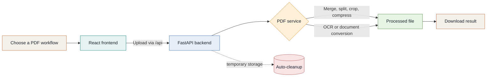

# PDF Matrix

> **Shape every document to fit the moment.**
>
> PDF Matrix is a privacy-first PDF workspace for the everyday jobs that usually send you hunting through five different tools. Merge, split, compress, convert, organize, and extract text from one focused interface.

[](LICENSE)
[](https://www.python.org/)
[](https://fastapi.tiangolo.com/)
[](https://react.dev/)

---

## The document toolkit

| Organize | Transform | Extract & export |
| --- | --- | --- |
| Merge PDF | Compress PDF | OCR PDF |
| Split PDF | Crop PDF | PDF to JPG |
| Delete Pages | JPG to PDF | Add Page Numbers |
| Organize PDF | Word to PDF |  |
|  | PowerPoint to PDF |  |

Every workflow is designed around the same simple rhythm: **upload, adjust, download**.

## How it works



## Run it locally

### Prerequisites

- Python 3.11 or newer
- Node.js and npm
- Ghostscript, Poppler, Tesseract, and LibreOffice for the full conversion toolset

Install the system dependencies with your platform's package manager:

```powershell
# Windows (Chocolatey)
choco install ghostscript libreoffice tesseract poppler
```

```bash
# macOS (Homebrew)
brew install ghostscript libreoffice tesseract poppler

# Ubuntu/Debian
sudo apt-get update
sudo apt-get install -y ghostscript libreoffice tesseract-ocr poppler-utils libmagic1
```

### Start the backend

```bash
cd backend
python -m venv .venv

# Windows: .venv\Scripts\activate
# macOS/Linux: source .venv/bin/activate
pip install -r requirements.txt
uvicorn app.main:app --reload --host 0.0.0.0 --port 8000
```

### Start the frontend

In a second terminal:

```bash
cd frontend
npm install
npm run dev
```

Open **[http://localhost:3000](http://localhost:3000)**. The Vite proxy forwards `/api` requests to the backend at `http://localhost:8000`.

For a one-command containerized setup:

```bash
docker-compose up --build
```

| Service | URL |
| --- | --- |
| PDF Matrix | [localhost:3000](http://localhost:3000) |
| API docs | [localhost:8000/api/docs](http://localhost:8000/api/docs) |
| ReDoc | [localhost:8000/api/redoc](http://localhost:8000/api/redoc) |

## Privacy by design

- Temporary uploads are removed automatically after processing.
- File types are checked by content, not only by extension.
- Filenames are sanitized before storage.
- Rate limiting helps protect the API from abusive traffic.
- No accounts, tracking, or third-party analytics are required.

Defaults can be adjusted in `backend/app/config.py` or with environment variables such as `MAX_FILE_SIZE`, `FILE_RETENTION_TIME`, `RATE_LIMIT`, `UPLOAD_DIR`, and `CORS_ORIGINS`.

## Project map

```text
PDF Matrix/
├── backend/
│   └── app/
│       ├── routers/       # FastAPI endpoints
│       ├── services/      # One focused module per PDF operation
│       └── utils/         # Validation, storage, and cleanup
├── frontend/
│   └── src/
│       ├── components/    # Shared UI building blocks
│       ├── pages/         # One screen per workflow
│       └── config/        # API and tool registry
├── docker-compose.yml
└── README.md
```

## Troubleshooting

| Symptom | Check |
| --- | --- |
| `Failed to fetch` | Confirm the backend is running on port `8000`. |
| OCR returns no text | Run `tesseract --version` and confirm it is on `PATH`. |
| Word or PowerPoint conversion fails | Run `soffice --version` and confirm LibreOffice is on `PATH`. |
| Compression cannot start | Run `gs --version` or `gswin64c --version` on Windows. |

## License

PDF Matrix is released under the [MIT License](LICENSE).
